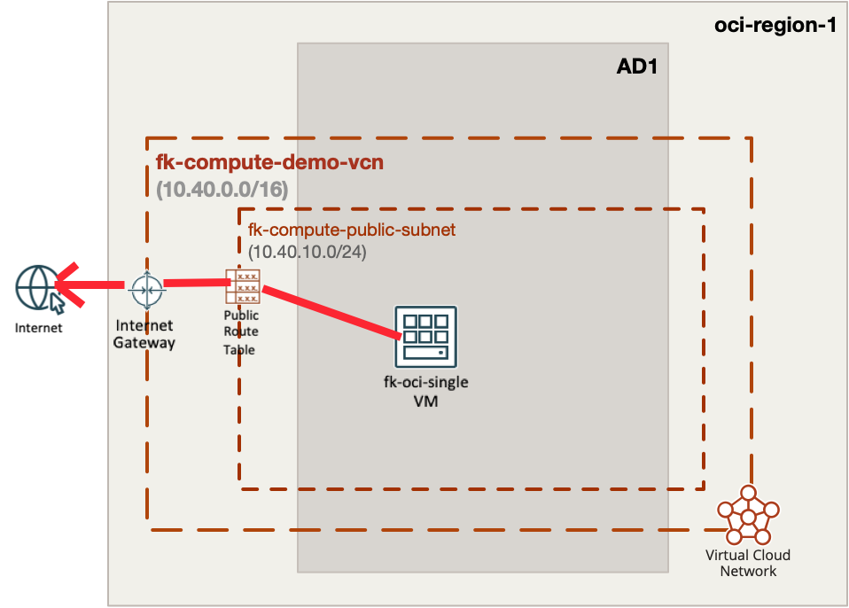
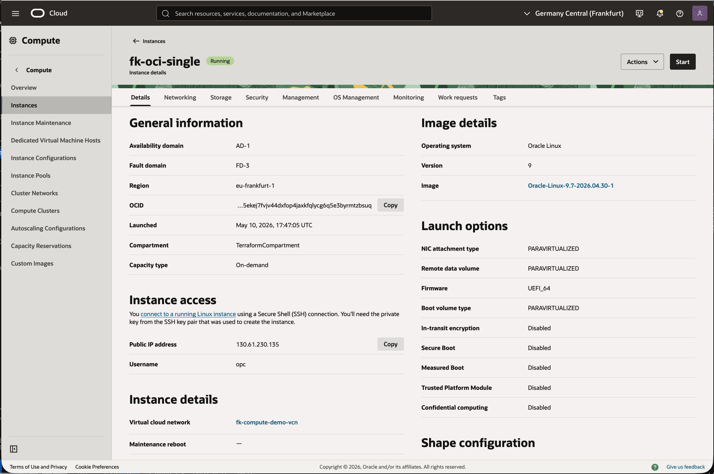
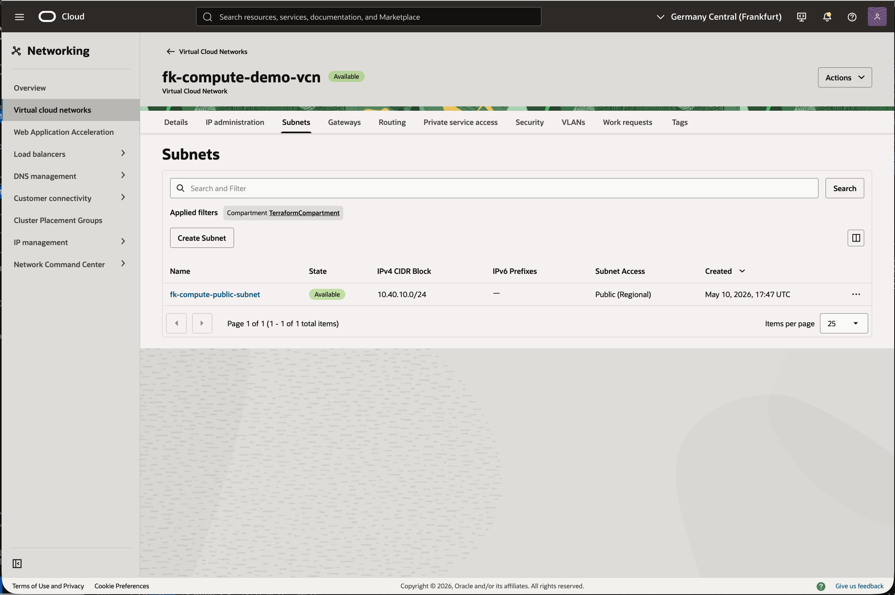
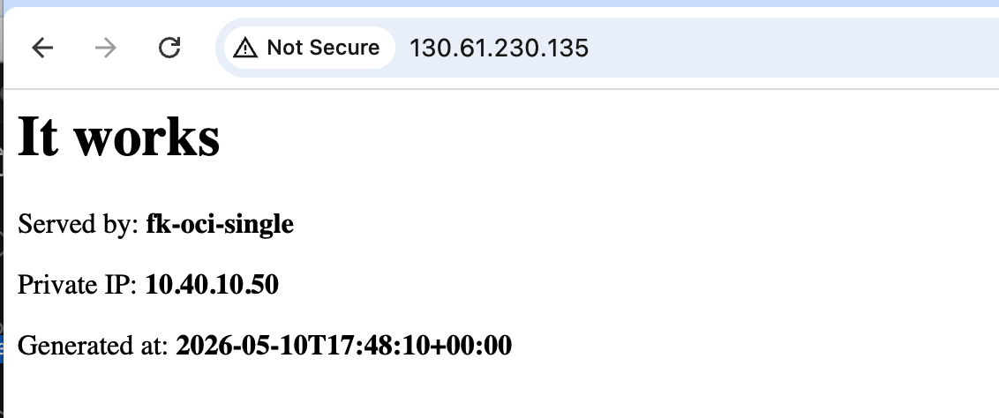

# Example 01: Single OCI Compute Instance

In this first compute example, we deploy a **single Oracle Cloud Infrastructure (OCI) compute instance**
using **Terraform/OpenTofu**.
The instance is launched into a **public subnet** created by the networking module,
uses **Oracle Linux 9**, and is bootstrapped with a simple **cloud-init** payload that starts an HTTP service.

This example is intentionally simple and focuses on the **regular single-instance deployment path**,
without instance pools, autoscaling, or load balancer integration.

---

## 🧭 Architecture Overview



This deployment creates:
- A dedicated **VCN** and one **public subnet** using `terraform-oci-fk-vcn`
- One **regular OCI compute instance**
- One **public IP** assigned on the primary VNIC
- A minimal **cloud-init bootstrap** that publishes a demo web page on port `80`

This is the most direct way to understand how the compute module behaves
when `deployment_mode = "instance"`.

---

## 🚀 Deployment Steps

Initialize and apply the Terraform/OpenTofu configuration:

```bash
tofu init
tofu plan
tofu apply
```

If you prefer Terraform:

```bash
terraform init
terraform plan
terraform apply
```

After a successful deployment, Terraform will output:
- The instance ID
- The private IP
- The public IP
- The VCN ID

These outputs make it easy to verify that the instance is reachable
and correctly attached to the public subnet.

---

## 🖼️ Runtime Notes

After deployment, the instance should:
- have a public IP on the primary VNIC
- expose a simple HTTP page on port `80`
- return instance-specific information generated by cloud-init

The demo payload writes a small HTML page that shows:
- hostname
- private IP
- generation timestamp

This makes the example useful as a quick smoke test for the module.

---

## 🖼️ OCI Console And Runtime Verification

### Instance Status



This view confirms that the compute instance is deployed successfully
and has both private and public addressing as expected for this public-subnet example.

### Network View



This view confirms that the instance is attached to the expected VCN and public subnet
created by `terraform-oci-fk-vcn`.

### HTTP Access



This runtime verification confirms that:
- the instance is reachable over its public IP
- the cloud-init bootstrap completed successfully
- the demo page returns hostname, private IP, and generation timestamp

---

## 🧹 Cleanup

To remove all resources created by this example:

```bash
tofu destroy
```

Or with Terraform:

```bash
terraform destroy
```

---

## ✅ Summary

This example demonstrates:
- How to deploy a **single OCI compute instance** using Terraform/OpenTofu
- How to use the compute module in `instance` mode
- How to combine the module with `terraform-oci-fk-vcn`
- How to bootstrap Oracle Linux 9 with a small demo cloud-init payload

---

## 🌐 Learn More

Visit [FoggyKitchen.com](https://foggykitchen.com/) for OCI, multicloud, and Terraform/OpenTofu learning resources.

---

## 🪪 License

Licensed under the **Universal Permissive License (UPL), Version 1.0**.  
See [LICENSE](../../LICENSE) for more details.

---

© 2026 [FoggyKitchen.com](https://foggykitchen.com) - Cloud. Code. Clarity.
