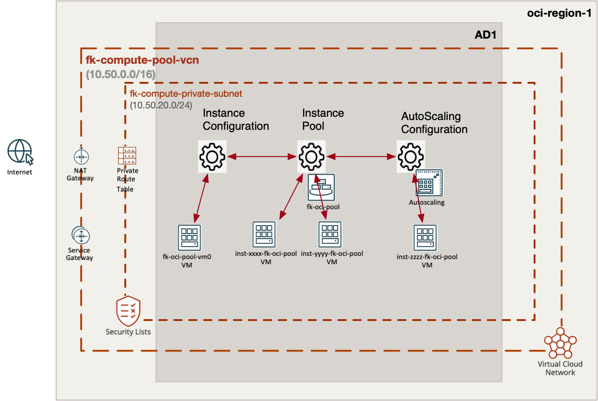
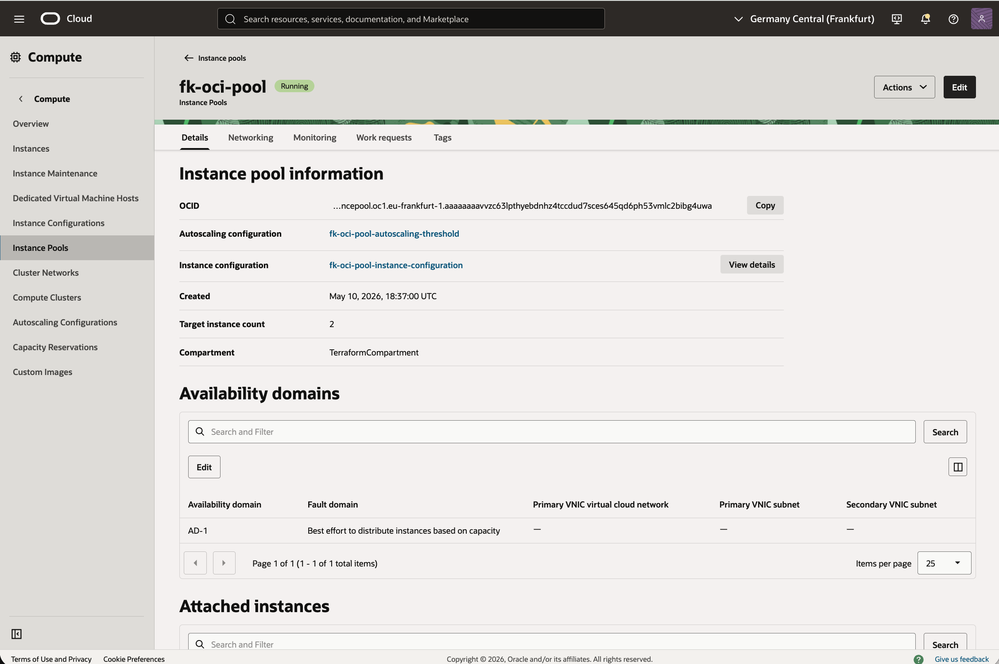
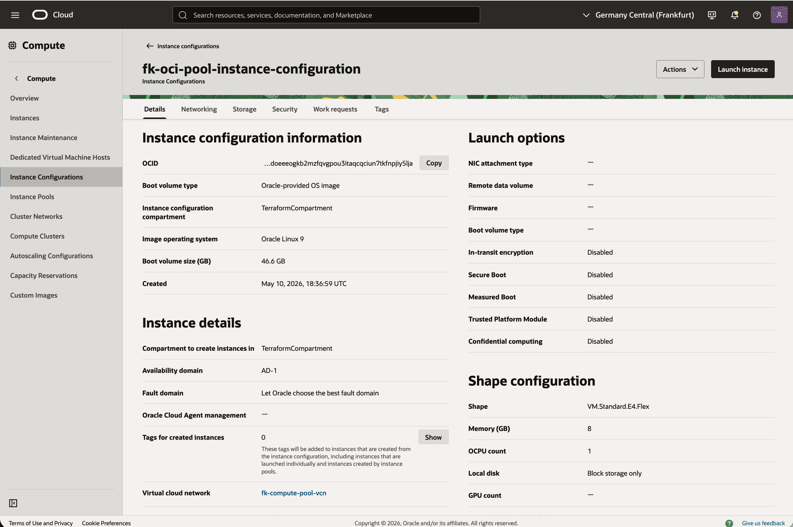
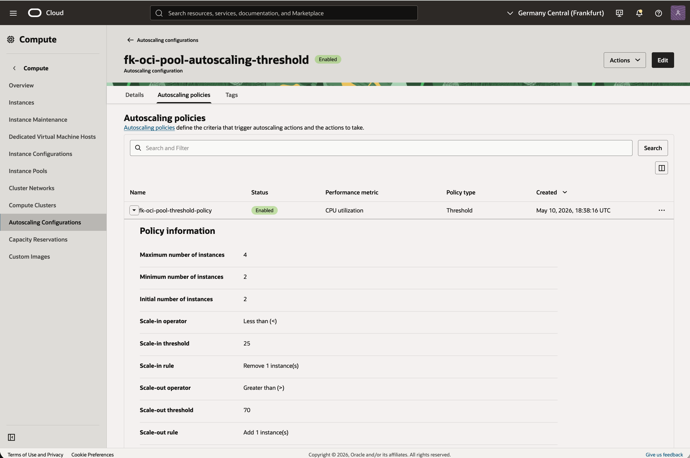
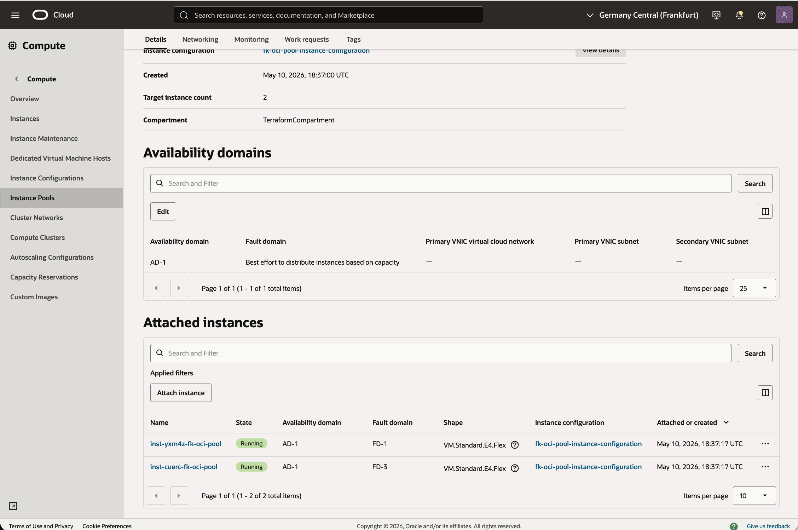

# Example 02: Instance Pool With Threshold Autoscaling

In this example, we deploy an **Oracle Cloud Infrastructure (OCI) instance pool**
using **Terraform/OpenTofu**, together with a **threshold-based autoscaling configuration**.
The pool instances run **Oracle Linux 9** and are bootstrapped with a small **cloud-init** payload
that starts a demo HTTP service.

This example focuses on the **elastic compute path** in OCI:
**instance configuration -> instance pool -> autoscaling configuration**.

---

## 🧭 Architecture Overview



This deployment creates:
- A dedicated **VCN** with one **private application subnet**
- One **instance configuration**
- One **instance pool**
- One **threshold autoscaling configuration**
- A minimal **cloud-init bootstrap** for every pool member

The pool is deployed into the **private subnet**,
while networking resources such as NAT and Service Gateway support outbound access where needed.

The architecture diagram illustrates the **autoscaling pattern and target topology**.
Depending on the current pool size and autoscaling activity,
the number of running instances immediately after `apply` may be lower than what is shown in the diagram.

---

## 🚀 Deployment Steps

Initialize and apply the Terraform/OpenTofu configuration:

```bash
tofu init
tofu plan
tofu apply
```

If you prefer Terraform:

```bash
terraform init
terraform plan
terraform apply
```

After a successful deployment, Terraform will output:
- The instance pool ID
- The autoscaling configuration ID
- The VCN ID

These outputs let you verify that the scaling stack was created successfully.

---

## 🖼️ Runtime Notes

After deployment, the environment should contain:
- a private backend subnet for pool members
- an OCI instance pool with initial capacity
- an autoscaling policy that reacts to CPU thresholds

The example uses:
- **Oracle Linux 9**
- **flex shape configuration**
- a **cloud-init** payload that starts an HTTP demo service on port `80`

This makes it a clean baseline for later load balancer-backed scenarios.

---

## 🖼️ OCI Console And Runtime Verification

### Instance Pool Status



This view confirms that the OCI instance pool is deployed successfully
and has the expected initial capacity after `apply`.

### Instance Configuration



This view shows the instance configuration used by the pool,
including the launch template from which pool members are created.

### Autoscaling Configuration



This view confirms that the threshold-based autoscaling policy is configured
for the instance pool and tied to the backend compute tier.

### Attached Instances



This view confirms that the pool members are attached and managed together
as one autoscaled compute group.

---

## 🧹 Cleanup

To remove all resources created by this example:

```bash
tofu destroy
```

Or with Terraform:

```bash
terraform destroy
```

---

## ✅ Summary

This example demonstrates:
- How to deploy an **OCI instance pool**
- How to enable **threshold-based autoscaling**
- How to use the compute module in `instance_pool` mode
- How to bootstrap all pool members with a shared Oracle Linux 9 cloud-init payload

---

## 🌐 Learn More

Visit [FoggyKitchen.com](https://foggykitchen.com/) for OCI, multicloud, and Terraform/OpenTofu learning resources.

---

## 🪪 License

Licensed under the **Universal Permissive License (UPL), Version 1.0**.  
See [LICENSE](../../LICENSE) for more details.

---

© 2026 [FoggyKitchen.com](https://foggykitchen.com) - Cloud. Code. Clarity.
