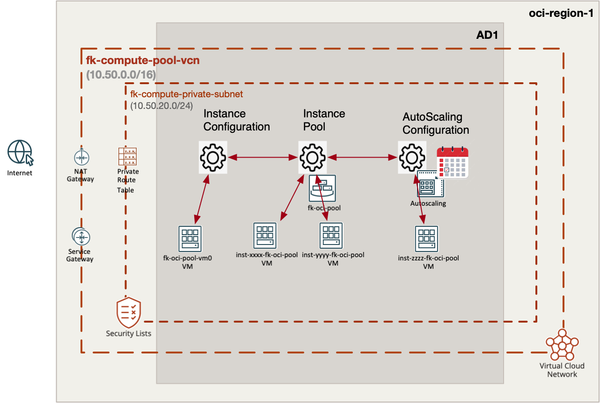
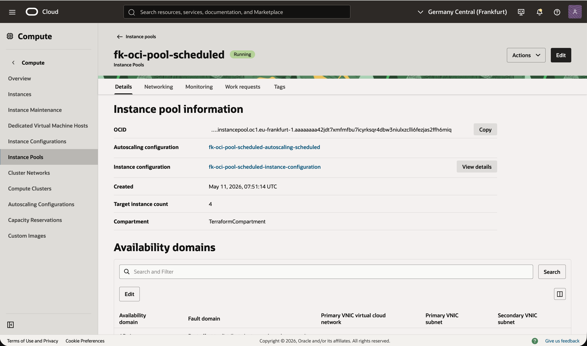
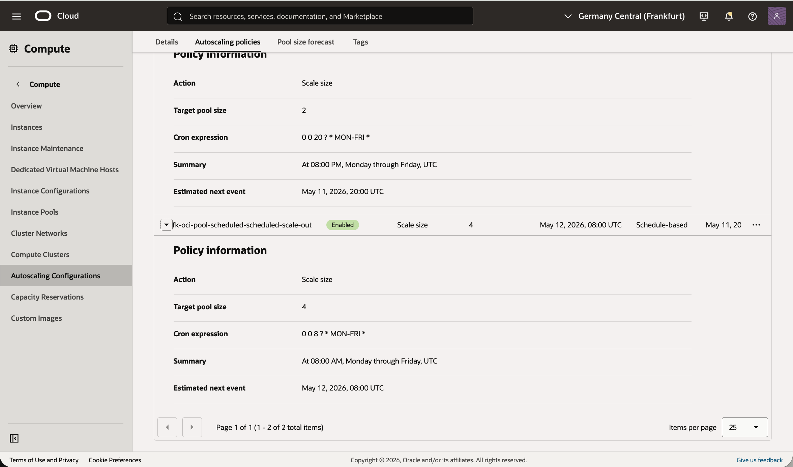
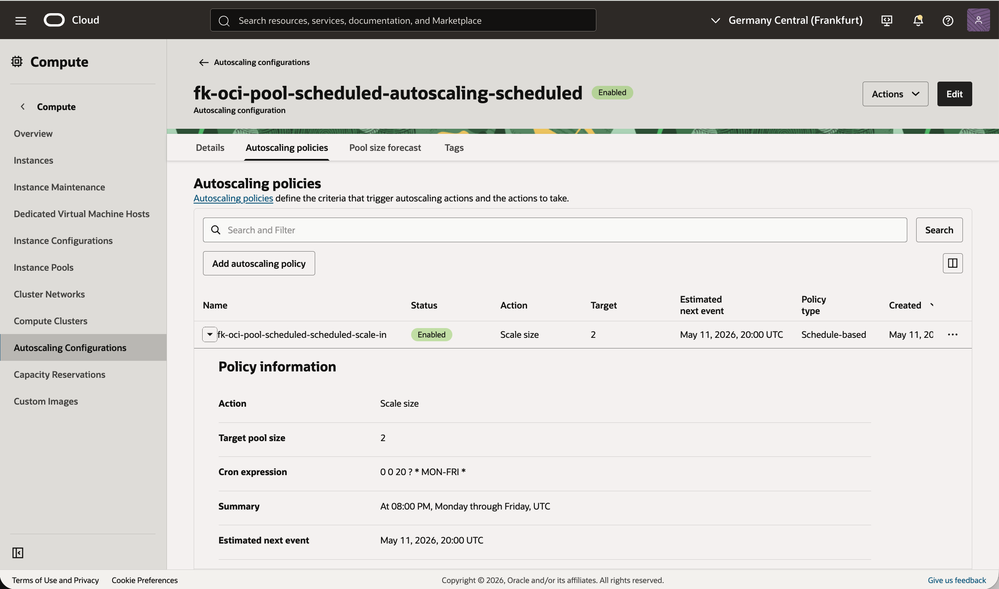
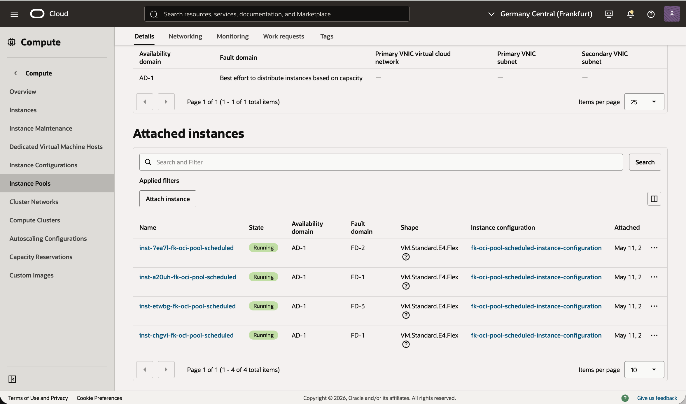

# Example 03: Instance Pool With Scheduled Autoscaling

In this example, we deploy an **Oracle Cloud Infrastructure (OCI) instance pool**
using **Terraform/OpenTofu**, together with a **scheduled autoscaling configuration**.
The pool instances run **Oracle Linux 9** and are bootstrapped with a small **cloud-init** payload
that starts a demo HTTP service.

Unlike Example 02, which scales based on CPU thresholds,
this example demonstrates the OCI-native scheduled scaling path using **cron expressions**.

---

## 🧭 Architecture Overview



This deployment creates:
- A dedicated **VCN** with one **private application subnet**
- One **instance configuration**
- One **instance pool**
- One **scheduled autoscaling configuration**
- A minimal **cloud-init bootstrap** for every pool member

The pool is deployed into the **private subnet**,
and scheduled scaling policies define when the pool should grow and shrink.

The architecture diagram illustrates the **scheduled autoscaling pattern and target topology**.
Depending on the current pool size and the active schedule window,
the number of running instances immediately after `apply` may be lower than what is shown in the diagram.

---

## 🚀 Deployment Steps

Initialize and apply the Terraform/OpenTofu configuration:

```bash
tofu init
tofu plan
tofu apply
```

If you prefer Terraform:

```bash
terraform init
terraform plan
terraform apply
```

After a successful deployment, Terraform will output:
- The instance pool ID
- The autoscaling configuration ID
- The VCN ID

These outputs let you confirm that the scheduled scaling path is configured correctly.

---

## 🖼️ Runtime Notes

After deployment, the environment should contain:
- a private backend subnet for pool members
- an OCI instance pool with scheduled capacity changes
- separate scheduled scale-out and scale-in definitions

The example uses:
- **Oracle Linux 9**
- **flex shape configuration**
- a **cloud-init** payload that starts an HTTP demo service on port `80`

This makes it a good reference for time-based capacity management in OCI.

---

## 🖼️ OCI Console And Runtime Verification

### Instance Pool Status



This view confirms that the OCI instance pool is deployed successfully
and shows the current backend capacity after `apply`.

### Scheduled Scale-Out Policy



This view shows the scheduled **scale-out** policy,
including the execution schedule used to increase capacity at the defined time.

### Scheduled Scale-In Policy



This view shows the scheduled **scale-in** policy,
including the execution schedule used to reduce capacity at the defined time.

### Attached Instances



This view confirms which compute instances are currently attached to the pool
for the scheduled autoscaling scenario.

---

## 🧹 Cleanup

To remove all resources created by this example:

```bash
tofu destroy
```

Or with Terraform:

```bash
terraform destroy
```

---

## ✅ Summary

This example demonstrates:
- How to deploy an **OCI instance pool**
- How to enable **scheduled autoscaling**
- How to use OCI cron expressions for compute capacity changes
- How to bootstrap all pool members with a shared Oracle Linux 9 cloud-init payload

---

## 🌐 Learn More

Visit [FoggyKitchen.com](https://foggykitchen.com/) for OCI, multicloud, and Terraform/OpenTofu learning resources.

---

## 🪪 License

Licensed under the **Universal Permissive License (UPL), Version 1.0**.  
See [LICENSE](../../LICENSE) for more details.
