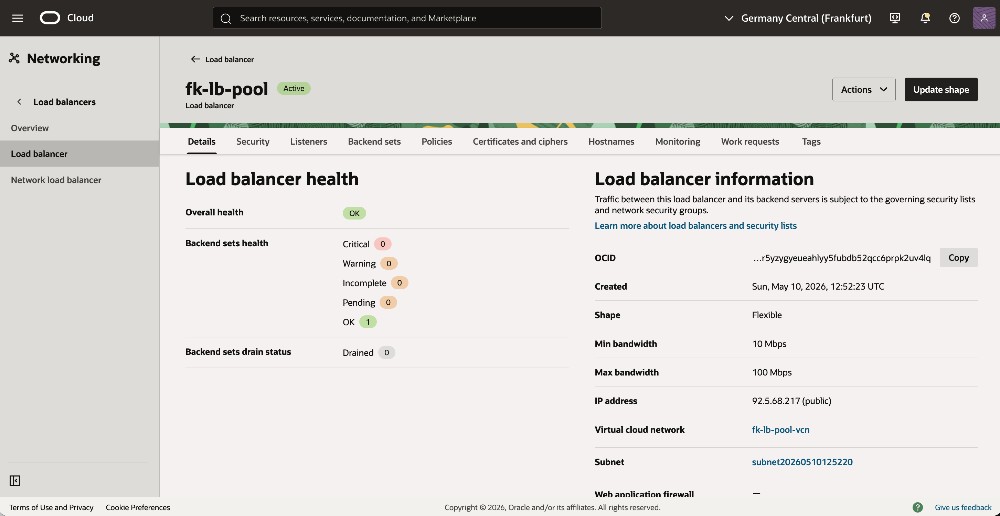
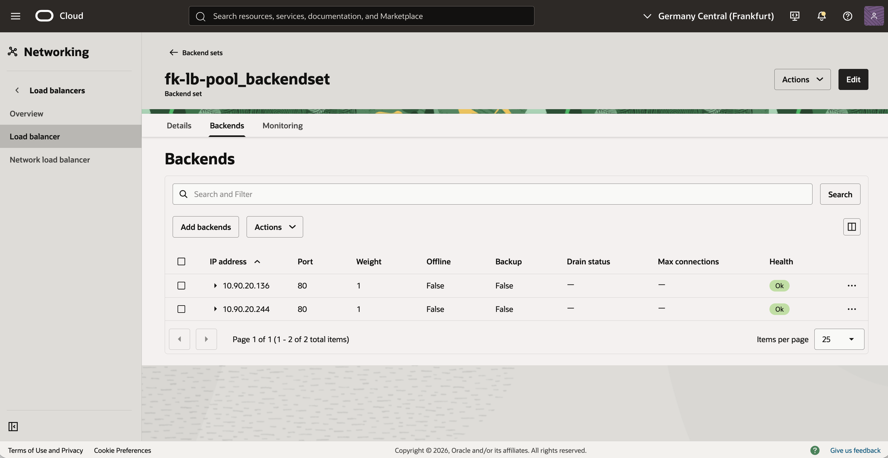
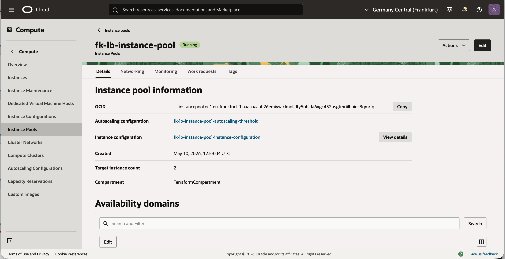
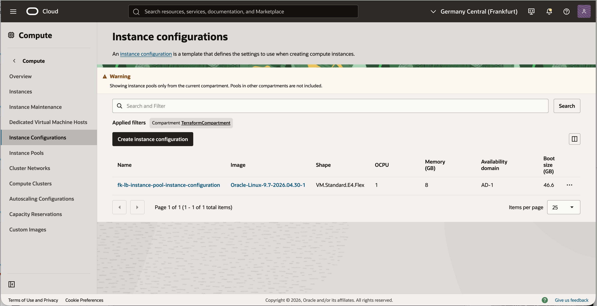
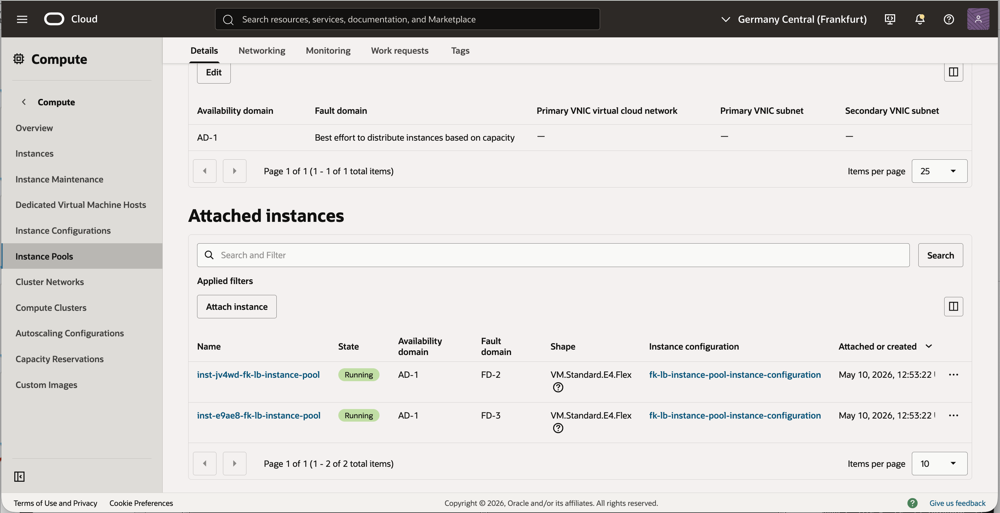
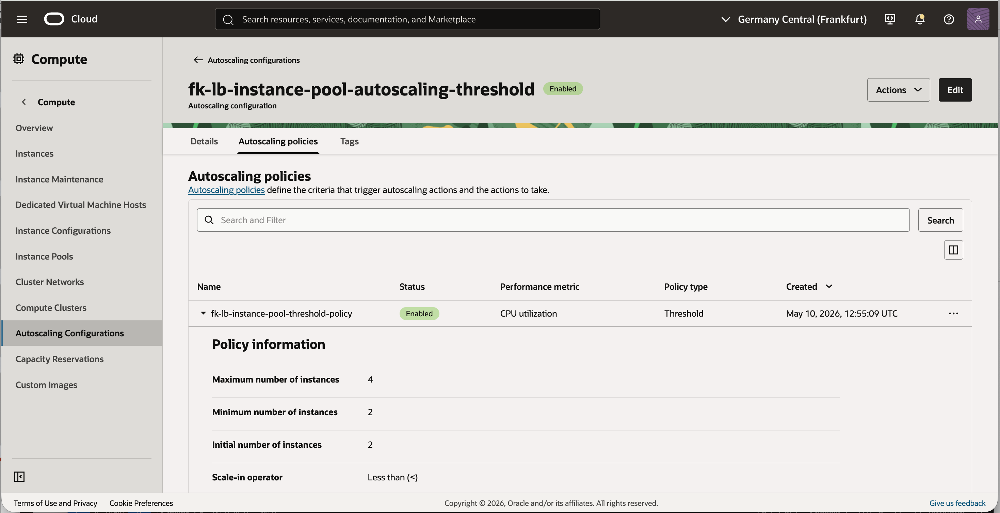
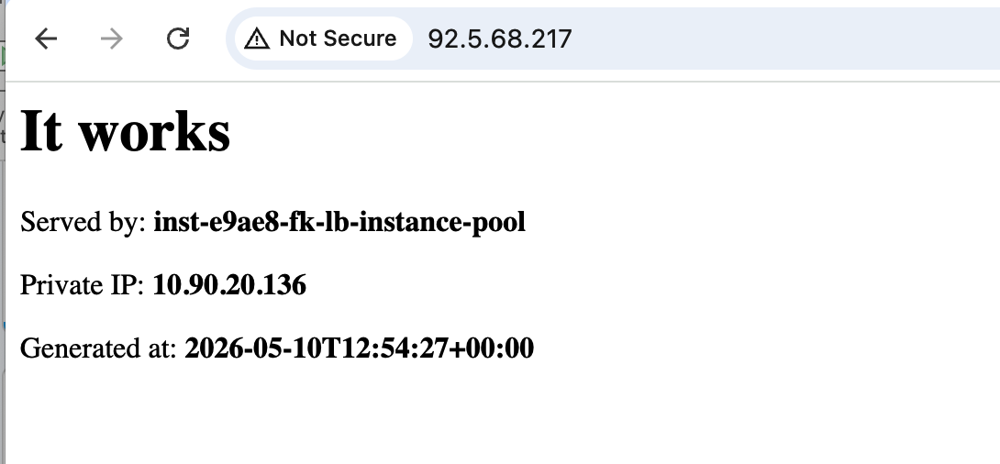

# Example 04: Instance Pool With Load Balancer

In this example, we deploy an **Oracle Cloud Infrastructure (OCI) instance pool**
behind a **public OCI Load Balancer** using **Terraform/OpenTofu**.
The environment combines:
- `terraform-oci-fk-vcn`
- `terraform-oci-fk-loadbalancer`
- `terraform-oci-fk-compute`

This example focuses on how the compute module participates in the integration through
`lb_attachment`, while also using **Oracle Linux 9**, **threshold autoscaling**,
and the shared **cloud-init** bootstrap.

---

## 🧭 Architecture Overview

This deployment creates:
- A dedicated **VCN** with one **public subnet** for the load balancer
- One **private subnet** for the backend instance pool members
- One **public OCI Load Balancer**
- One **instance configuration**
- One **instance pool**
- One **threshold autoscaling configuration**
- A shared **cloud-init bootstrap** for all pool members

Traffic flow:
- Clients connect to the public IP of the OCI Load Balancer
- The load balancer forwards HTTP traffic to private pool members on port `80`
- Backend instances remain private and are not exposed directly to the internet

---

## 🚀 Deployment Steps

Initialize and apply the Terraform/OpenTofu configuration:

```bash
tofu init
tofu plan
tofu apply
```

If you prefer Terraform:

```bash
terraform init
terraform plan
terraform apply
```

After a successful deployment, Terraform will output:
- The instance pool ID
- The autoscaling configuration ID
- The load balancer ID
- The load balancer public IPs
- The VCN ID

These outputs let you verify both the compute and traffic distribution layers.

---

## 🖼️ OCI Console And Runtime Verification

### Load Balancer Status



### Backend Health



### Instance Pool Status



### Instance Configuration



### Attached Pool Instances



### Autoscaling Configuration



### HTTP Access Through The Load Balancer



After deployment, you should see:
- a public OCI Load Balancer with healthy backends
- an instance pool attached through `lb_attachment`
- autoscaling configuration active for the backend tier
- HTTP traffic successfully reaching private pool members

---

## 🧹 Cleanup

To remove all resources created by this example:

```bash
tofu destroy
```

Or with Terraform:

```bash
terraform destroy
```

---

## ✅ Summary

This example demonstrates:
- How to attach an **OCI instance pool** to a **public OCI Load Balancer**
- How to compose VCN, Load Balancer, and Compute modules together
- How to use `lb_attachment` from the compute side
- How to run Oracle Linux 9 pool members with a shared cloud-init bootstrap

---

## 🌐 Learn More

Visit [FoggyKitchen.com](https://foggykitchen.com/) for OCI, multicloud, and Terraform/OpenTofu learning resources.

---

## 🪪 License

Licensed under the **Universal Permissive License (UPL), Version 1.0**.  
See [LICENSE](../../LICENSE) for more details.
