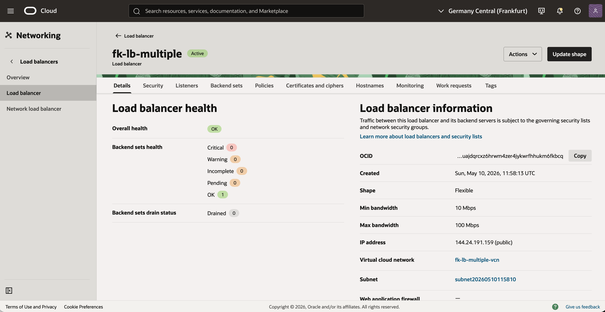
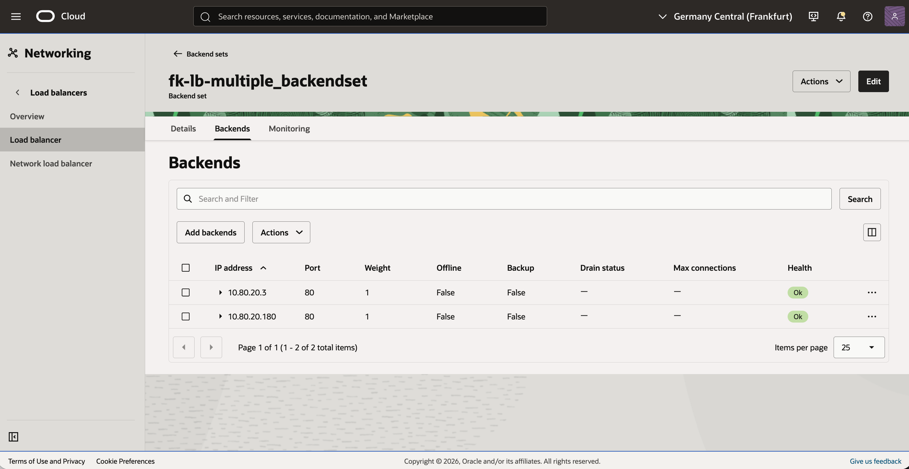
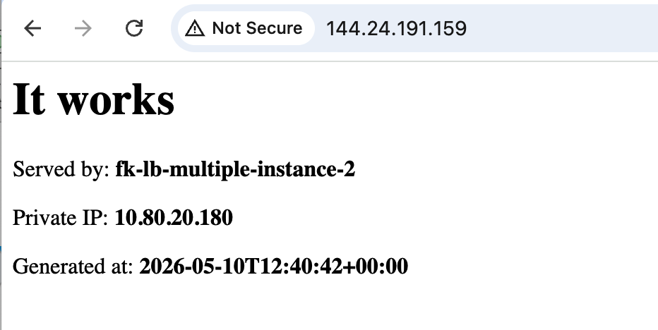

# Example 05: Multiple Instances With Load Balancer

In this example, we deploy **multiple regular Oracle Cloud Infrastructure (OCI) compute instances**
behind a **public OCI Load Balancer** using **Terraform/OpenTofu**.
The environment combines:
- `terraform-oci-fk-vcn`
- `terraform-oci-fk-loadbalancer`
- `terraform-oci-fk-compute`

This example mirrors the classic static-backend pattern:
multiple Oracle Linux 9 instances are created with `count`,
bootstrapped by the shared **cloud-init** payload,
and attached to the load balancer as **static private-IP backends**.

---

## 🧭 Architecture Overview

This deployment creates:
- A dedicated **VCN** with one **public subnet** for the load balancer
- One **private subnet** for the backend instances
- One **public OCI Load Balancer**
- `instance_count` regular compute instances in the private subnet
- One backend set populated from backend private IPs
- A shared **cloud-init bootstrap** that starts a demo HTTP service on every instance

Traffic flow:
- Clients connect to the public IP of the OCI Load Balancer
- The load balancer forwards HTTP traffic to private backend instances on port `80`
- Backend instances remain private and are not exposed directly to the internet

---

## 🚀 Deployment Steps

Initialize and apply the Terraform/OpenTofu configuration:

```bash
tofu init
tofu plan
tofu apply
```

If you prefer Terraform:

```bash
terraform init
terraform plan
terraform apply
```

To scale the number of backend instances, set `instance_count` to `2` or more,
for example in `terraform.tfvars`:

```hcl
instance_count = 3
```

After a successful deployment, Terraform will output:
- The load balancer ID
- The load balancer public IPs
- The backend instance private IPs

These outputs make it easy to test the public frontend and verify backend registration.

---

## 🖼️ OCI Console And Runtime Verification

### Load Balancer Status



### Backend Health



### HTTP Access Through The Load Balancer



After deployment, you should see:
- a public OCI Load Balancer with healthy static backends
- multiple backend instances attached by private IP
- HTTP traffic distributed across regular instances created by the compute module

Refreshing the browser should return responses from different backend nodes.

---

## 🧹 Cleanup

To remove all resources created by this example:

```bash
tofu destroy
```

Or with Terraform:

```bash
terraform destroy
```

---

## ✅ Summary

This example demonstrates:
- How to deploy **multiple regular OCI instances**
- How to attach them to a **public OCI Load Balancer** as static backends
- How to use the compute module with `count`
- How to run Oracle Linux 9 backends with a shared cloud-init bootstrap

---

## 🌐 Learn More

Visit [FoggyKitchen.com](https://foggykitchen.com/) for OCI, multicloud, and Terraform/OpenTofu learning resources.

---

## 🪪 License

Licensed under the **Universal Permissive License (UPL), Version 1.0**.  
See [LICENSE](../../LICENSE) for more details.

---

© 2026 [FoggyKitchen.com](https://foggykitchen.com) - Cloud. Code. Clarity.
